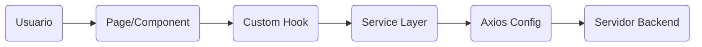

# Sistema de Gestión de Casos - Frontend

Este proyecto es la interfaz de usuario (Frontend) para el Sistema de Gestión de Casos. Está construido con una arquitectura moderna basada en **React**, **TypeScript** y **Vite**, utilizando **Material UI** para la interfaz gráfica.

## 🛠️ Stack Tecnológico

El proyecto utiliza las siguientes tecnologías y librerías clave:

-   **Core**: [React 18](https://react.dev/) + [TypeScript](https://www.typescriptlang.org/)
-   **Build Tool**: [Vite](https://vitejs.dev/) (Rápido, HMR, optimizado)
-   **UI Framework**: [Material UI (MUI)](https://mui.com/) v5+
-   **Enrutamiento**: [React Router DOM](https://reactrouter.com/) v6+
-   **Cliente HTTP**: [Axios](https://axios-http.com/)
-   **Manejo de Fechas**: [date-fns](https://date-fns.org/)
-   **Linting**: ESLint

## 🚀 Instalación y Ejecución

### Prerrequisitos
-   [Node.js](https://nodejs.org/) (Versión recomendada: v18+ o v20 LTS)
-   npm (viene con Node.js)

### Pasos para iniciar
1.  **Clonar el repositorio** (si aplica) o descargar el código.
2.  **Instalar dependencias**:
    Abrir una terminal en la carpeta raíz del proyecto y ejecutar:
    ```bash
    npm install
    ```
3.  **Correr en desarrollo**:
    Para iniciar el servidor local:
    ```bash
    npm run dev
    ```
    La aplicación estará disponible típicamente en `http://localhost:5173`.

4.  **Construir para producción**:
    Para generar los archivos estáticos optimizados en la carpeta `dist/`:
    ```bash
    npm run build
    ```

## 🏗️ Arquitectura del Proyecto

El proyecto sigue una **Arquitectura en Capas (Layered Architecture)** para separar responsabilidades y facilitar el mantenimiento.

### Estructura de Carpetas (`src/`)

| Carpeta | Descripción |
| :--- | :--- |
| **`api/`** | Configuración del cliente HTTP (Axios). Define la URL base y los interceptores si son necesarios (`axio.ts`). |
| **`components/`** | Componentes de la interfaz de usuario (UI). <br> - `common/`: Componentes reutilizables (botones, inputs genéricos). <br> - `modals/`, `drawers/`: Ventanas emergentes y paneles laterales. |
| **`layout/`** | Estructuras principales de las páginas (ej. `MainLayout` que incluye Navbar/Sidebar). |
| **`pages/`** | Vistas principales de la aplicación. Cada archivo aquí corresponde a una ruta URL (ej. `Dashboard`, `Login`, `CaseDetail`). |
| **`services/`** | Lógica de negocio y llamadas a la API Backend. Los componentes UI usan estos servicios para no llamar directamente a Axios. |
| **`hooks/`** | Custom Hooks para lógica de estado compleja y reutilizable (ej. `useDashboard`). |
| **`types/`** | Definiciones de tipos e interfaces TypeScript (Modelos de datos). |
| **`context/`** | (Opcional) Contextos de React para estado global. |
| **`utils/`** | Funciones utilitarias puras (formateo, validaciones). |

### Diagrama de Flujo de Datos


## 📖 Guía de Desarrollo

### 1. Agregar una nueva página
1.  Crear el componente en `src/pages/NuevaPagina.tsx`.
2.  Registrar la ruta en `src/App.tsx` dentro de `<Routes>`.

### 2. Conectar con el Backend
1.  Definir la interfaz de datos en `src/types/`.
2.  Crear un servicio en `src/services/` con las funciones de llamada (GET, POST).
3.  Usar el servicio dentro de un `useEffect` o un Custom Hook en el componente.

### 3. Estilos
Se recomienda usar los componentes de **Material UI** (`Box`, `Typography`, `Grid`, `Stack`) y la prop `sx={{ ... }}` para estilos personalizados, en lugar de archivos CSS tradicionales, para mantener la consistencia del sistema de diseño.

---
*Documento generado para el equipo de desarrollo.*
